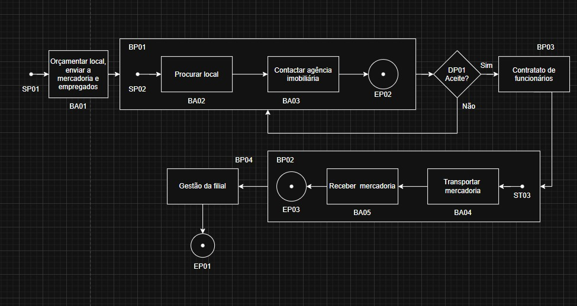
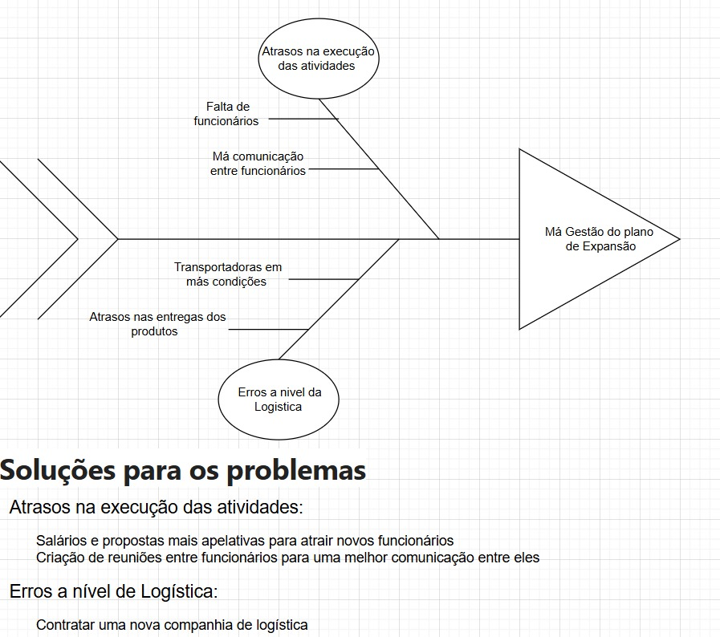
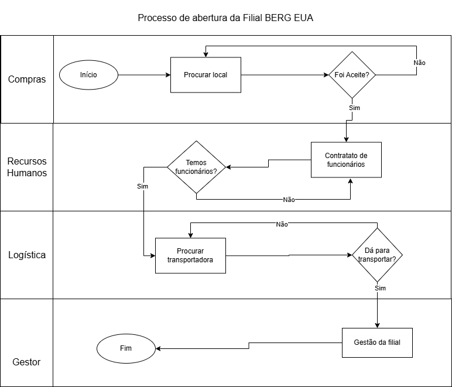
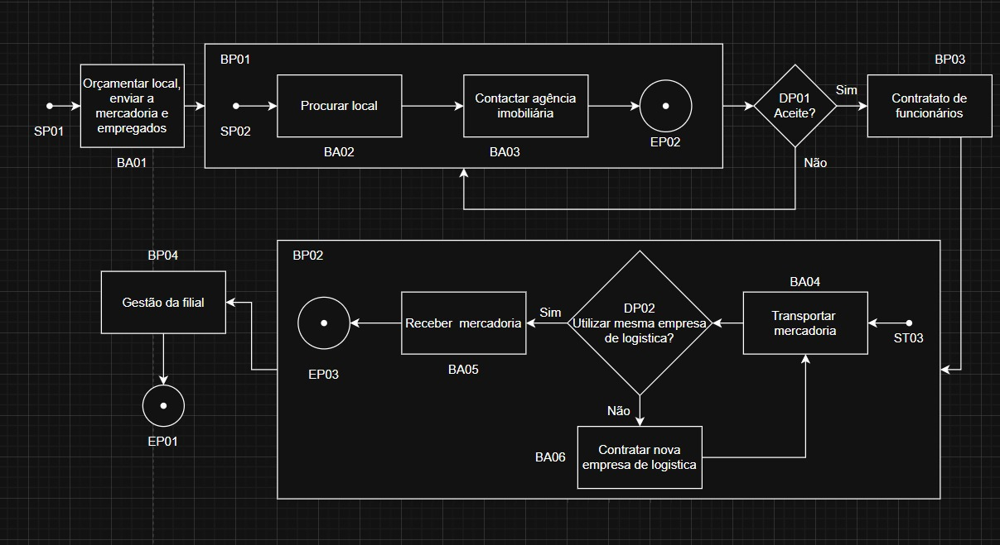

# Discussão do trabalho

## Orçamento
### Analise de compra do local
1. Contactar agencia
2. Propor orçamentos
- Se não der, procurar outra agência

Pessoa: Compras

### Analise de contratos de trabalho
1. Recorrer agências de contrato 
2. recrutamento
- Se não houver mais candidatos, recorrer a outras pessoas

Pessoa: RH

### Analise de transporte da mercadoria
1. Procurar transportadoras
2. Propor tempo, carga e orçamento
- Se não der, procurar outro sítio

Pessoa: Logística

### Inicio da montagem da filial
1. Apresentar a estrutura na filial
2. Organizar funcionários 
3. Organizar mercadoria
4. Iniciar abertura

Pessoa: Gestor
          

## Problema

1. A mudança

1.1 Coordenar e estruturar como se vai controlar a nova filiar 
1.2 Analisar a concorrência

2. O local

2.1 Verificar se alguém tem interesse no terreno

3. Os Funcionários

3.1 Não haver candidatos para as vagas pretendidas 
3.2 Exigirem condições 

4. transporte

4.1 Transportadoras não terem disponibilidade para levar 
4.2 Barco tem tendencia a ter acidente e/ou ser lento 
4.3 avião tem tendência a ser mais caro

## Solução

1.1 Organizar com organograma a estrutura da filial
1.2 investir no marketing

2.1 Propor outra oferta 
2.2 Procurar outro sitio ou outra agência

3.1 Analisar perfis nas agências ou Linkdin 
3.2 Negociar propostas para os mais exigentes

4.1 Contactar várias transportadoras e ver qual mais rápido e barato

                

# Diagramas

## Diagrama de processos

                        

## Diagrama Fishbone

               

## Diagrama Swimlane

                 

## Diagrama de processos com as soluções
